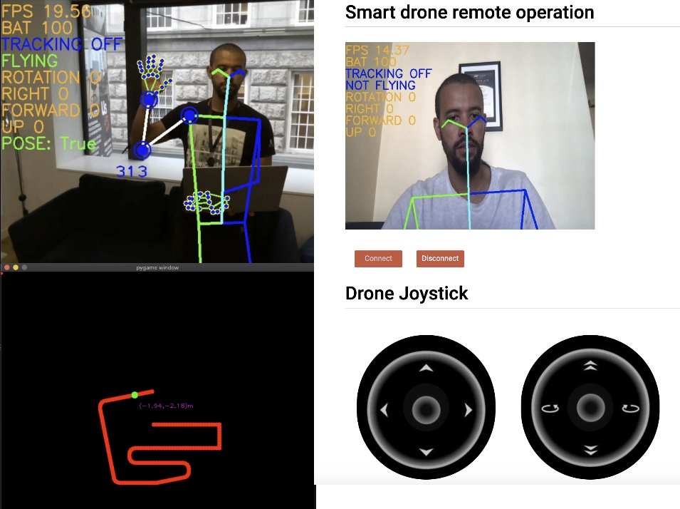

# Smart drone

This project leverage from Machine learning/Computer vision and Robotics
to make a lower cost Drone smarter([Tello](https://m.dji.com/ie/shop/tello-series)).

## Features  
- Control the drone by gestures
- People tracking
- People searching
- Sound feedback
- Morse commands using camera
- Keyboard control
- Drone path monitoring
- Drone path planning
- Video streaming using Webrtc
- Remote control using websocket
- HTML 5 joystick control
- Apple IOS joystick control (check the ios branch)

The gesture module was highly inspired by [Tello-openpose](https://github.com/geaxgx/tello-openpose)
 
-----
## Free Advanced Java Course
I am the author of the [Advanced Java for adults course](https://www.udemy.com/course/advanced-java-for-adults/?referralCode=8014CCF0A5A931ADED5F). This course contains advanced and not conventional lessons. In this course, you will learn to think differently from those who have a limited view of software development. I will provoke you to reflect on decisions that you take in your day to day job, which might not be the best ones. This course is for middle to senior developers and we will not teach Java language features but how to lead complex Java projects. 

This course's lectures are based on a Trading system, an opensource project hosted on my [Github](https://github.com/apssouza22/trading-system).

-----
